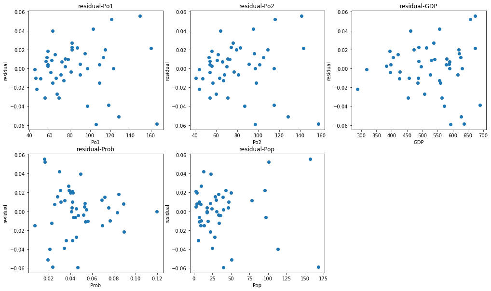

# 1. Apply a multiple linear regression on the given dataset

## Variable list
- M: percentage of males aged 14-24
- So: whether it is in a Southern state. 1 for Yes, 0 for No.
- Ed: mean years of schooling
- Po1: police expenditure in 1960
- Po2: police expenditure in 1959
- LF: labour force participation rate
- M.F: number of males per 1000 females
- Pop: state population
- NW: number of non-whites resident per 1000 people
- U1: unemployment rate of urban males aged 14-24
- U2: unemployment rate of urban males aged 35-39
- GDP: gross domestic product per head
- Ineq: income inequality
- Prob: probability of imprisonment
- Time: average time served in prisons
- y: crime rate in an unspecified unit region (target)

## 주어진 데이터에 대하여 공선성 확인, 다중회기 수행 및 평가


```python
# packages and data import
# DO NOT CHANGE THIS PART
import pandas as pd
import numpy as np
from sklearn.linear_model import LinearRegression
import matplotlib.pyplot as plt
from scipy.stats import t, f, chi2, skew, kurtosis
%matplotlib inline
data=pd.read_csv('https://drive.google.com/uc?export=download&id=1ssBNxmds4zmmJbAHzJUB0_UyyfyMtoHT')
```

(1) Find the top 5 input variables that show the high linear correlation with the target based on the correlation coefficient. 

### target 변수와의 상관 관계 확인


```python
data_corr = abs(data.corr())
data_corr = data_corr.tail(1)
data_corr = data_corr.sort_values(by="y",axis = 1, ascending = False)
top_5 = data_corr.iloc[0,1:6]
top_5
```


    Po1     0.687604
    Po2     0.666714
    GDP     0.441320
    Prob    0.427422
    Pop     0.337474
    Name: y, dtype: float64


(2) Draw pairwise scatter plot – one scatter plot illustrates the relationship between the input variable selected in Question (1) and output target 

### target 변수와의 상관 관계 확인을 위한 산점도 


```python
X = data[top_5.index]
y = data["y"].values

plt.figure(figsize = (17,10))

plt.subplot(2,3,1)
plt.scatter(X.iloc[:,0],y)
plt.xlabel("Po1")
plt.ylabel("y")
plt.title("y-Po1")

plt.subplot(2,3,2)
plt.scatter(X.iloc[:,1],y)
plt.xlabel("Po2")
plt.ylabel("y")
plt.title("y-Po2")

plt.subplot(2,3,3)
plt.scatter(X.iloc[:,2],y)
plt.xlabel("GDP")
plt.ylabel("y")
plt.title("y-GDP")

plt.subplot(2,3,4)
plt.scatter(X.iloc[:,3],y)
plt.xlabel("Prob")
plt.ylabel("y")
plt.title("y-Prob")

plt.subplot(2,3,5)
plt.scatter(X.iloc[:,4],y)
plt.xlabel("Pop")
plt.ylabel("y")
plt.title("y-Pop")
```


    Text(0.5, 1.0, 'y-Pop')


    

    


(3) Train a linear regression model (M1) using the selected variables in Question (1) and fill the following table. 

### target 변수와 상관도가 높은 변수들을 이용하여 선형 회귀 수행
### 회귀 계수, 표준 편차, t-value, p-value 를 각 변수에 대하여 계산


```python
M1 = LinearRegression()
X = data[top_5.index]
y = data["y"].values
M1.fit(X,y)

# Coefficient(β_i) - 회귀 계수
print("Coefficient(β_i)")
print(M1.intercept_)
print(M1.coef_)

print("\n")

# standard error(β_i)
print("se(β_i)")
n,p = X.shape

X = X.values
X = np.c_[np.ones(n),X]
XtX = np.matmul(X.T, X)
inv_XtX = np.linalg.inv(XtX)
beta = np.matmul(np.matmul(inv_XtX, X.T), y).flatten()

y_pred = np.matmul(X, beta)

SSE = np.sum((y-y_pred)**2)
MSE = SSE/(n-p-1)

se2_beta = MSE*inv_XtX
se_beta = np.sqrt(se2_beta)
print(pd.DataFrame(se_beta))

print("\n")

# t_value
print("t")

t_intercept = beta[0]/se_beta[0,0]
print("t_intercept : " , t_intercept)
t_Po1 = beta[1]/se_beta[1,1]
print("t_Po1 : " , t_Po1)
t_Po2 = beta[2]/se_beta[2,2]
print("t_Po2 : " , t_Po2)
t_GDP = beta[3]/se_beta[3,3]
print("t_GDP : " , t_GDP)
t_Prob = beta[4]/se_beta[4,4]
print("t_Prob : " , t_Prob)
t_Pop = beta[5]/se_beta[5,5]
print("t_Pop : " , t_Pop)


print("\n")

# p_value
print("p_value")

p_value_intercept = (1-t.cdf(np.abs(t_intercept), n-p-1))*2
print("p_value_intercept : " , p_value_intercept)
p_value_Po1 = (1-t.cdf(np.abs(t_Po1), n-p-1))*2
print("p_value_Po1 : " , p_value_Po1)
p_value_Po2 = (1-t.cdf(np.abs(t_Po2), n-p-1))*2
print("p_value_Po2 : " , p_value_Po2)
p_value_GDP = (1-t.cdf(np.abs(t_GDP), n-p-1))*2
print("p_value_GDP : " , p_value_GDP)
p_value_Prob = (1-t.cdf(np.abs(t_Prob), n-p-1))*2
print("p_value_Prob : " , p_value_Prob)
p_value_Pop = (1-t.cdf(np.abs(t_Pop), n-p-1))*2
print("p_value_Pop : " , p_value_Pop)
```

    Coefficient(β_i)
    0.09228756786185388
    [ 2.62474439e-03 -1.49015707e-03 -1.53743853e-04 -4.13347529e-01
     -1.38774123e-04]
    
    
    se(β_i)
              0         1         2         3         4         5
    0  0.034898       NaN  0.001988       NaN       NaN       NaN
    1       NaN  0.001213       NaN  0.000009  0.001632       NaN
    2  0.001988       NaN  0.001294       NaN       NaN  0.000097
    3       NaN  0.000009       NaN  0.000075  0.002474  0.000050
    4       NaN  0.001632       NaN  0.002474  0.218330  0.002468
    5       NaN       NaN  0.000097  0.000050  0.002468  0.000130
    
    
    t
    t_intercept :  2.644527949497416
    t_Po1 :  2.164665002667829
    t_Po2 :  -1.1517856043711845
    t_GDP :  -2.0422965537392863
    t_Prob :  -1.8932265882155301
    t_Pop :  -1.0668652044513207
    
    
    p_value
    p_value_intercept :  0.011541148685453972
    p_value_Po1 :  0.03628787314993942
    p_value_Po2 :  0.2560814022759499
    p_value_GDP :  0.04758909240270759
    p_value_Prob :  0.06540028146572907
    p_value_Pop :  0.2922747607879439
    

    C:\Users\aaaa\anaconda3\lib\site-packages\ipykernel_launcher.py:29: RuntimeWarning: invalid value encountered in sqrt
    

(4) Calculate VIF for the variables of M1. Given that multicollinearity is severe when there is a variable with a VIF value of greater than 10, find the most reasonable way to get a better model based on the calculated VIF values.  

### 다중 공선성 파악을 위해 각 변수마다 VIF(Variance Inflation Factor) 계산


```python
M1.fit(data[['Po2','GDP','Pop','Prob']], data['Po1'])
Po1_sc = M1.score(data[['Po2','GDP','Pop','Prob']], data['Po1']) 
vif_Po1=1/(1-Po1_sc)
print("vif_Po1 : ", vif_Po1)

M1.fit(data[['Po1','GDP','Pop','Prob']], data['Po2'])
Po2_sc = M1.score(data[['Po1','GDP','Pop','Prob']], data['Po2']) 
vif_Po2=1/(1-Po2_sc)
print("vif_Po2 : ", vif_Po2)

M1.fit(data[['Po2','Po1','Pop','Prob']], data['GDP'])
GDP_sc = M1.score(data[['Po2','Po1','Pop','Prob']], data['GDP']) 
vif_GDP=1/(1-GDP_sc)
print("vif_GDP : ", vif_GDP)

M1.fit(data[['Po2','Po1','GDP','Prob']], data['Pop'])
Pop_sc = M1.score(data[['Po2','Po1','GDP','Prob']], data['Pop']) 
vif_Pop=1/(1-Pop_sc)
print("vif_Pop : ", vif_Pop)
M1.fit(data[['Po2','Po1','Pop','GDP']], data['Prob'])
Prob_sc = M1.score(data[['Po2','Po1','Pop','GDP']], data['Prob']) 
vif_Prob=1/(1-Prob_sc)
print("vif_Prob : ", vif_Prob)
```

    vif_Po1 :  80.34832161088916
    vif_Po2 :  80.97531630356094
    vif_GDP :  3.2647323097391228
    vif_Pop :  1.5174252113126923
    vif_Prob :  1.5247804645690084
    

### VIF가 가장 높은 Po2변수 가 다중공선성 문제가 가장 심각하다는 결론
### Po2변수를 input variable에서 제거

(5) Based on the way you provide in Question (1), train a new regression model (M2) and fill the following table. 


```python
X = data[["Po1","GDP","Prob","Pop"]]
y = data["y"].values

M2 = LinearRegression()
M2.fit(X,y)

# Coefficient(β_i)
print("Coefficient(β_i)")
print(M2.intercept_)
print(M2.coef_)

print("\n")

# se(β_i)
print("se(β_i)")
n,p = X.shape

X = X.values
X = np.c_[np.ones(n),X]
XtX = np.matmul(X.T, X)
inv_XtX = np.linalg.inv(XtX)
beta = np.matmul(np.matmul(inv_XtX, X.T), y).flatten()

y_pred = np.matmul(X, beta)

SSE = np.sum((y-y_pred)**2)
MSE = SSE/(n-p-1)

se2_beta = MSE*inv_XtX
se_beta = np.sqrt(se2_beta)
print(pd.DataFrame(se_beta))

print("\n")

# t
print("t")

t_intercept = beta[0]/se_beta[0,0]
print("t_intercept : " , t_intercept)
t_Po1 = beta[1]/se_beta[1,1]
print("t_Po1 : " , t_Po1)
t_GDP = beta[2]/se_beta[2,2]
print("t_GDP : " , t_GDP)
t_Prob = beta[3]/se_beta[3,3]
print("t_Prob : " , t_Prob)
t_Pop = beta[4]/se_beta[4,4]
print("t_Pop : " , t_Pop)


print("\n")

# p_value
print("p_value")

p_value_intercept = (1-t.cdf(np.abs(t_intercept), n-p-1))*2
print("p_value_intercept : " , p_value_intercept)
p_value_Po1 = (1-t.cdf(np.abs(t_Po1), n-p-1))*2
print("p_value_Po1 : " , p_value_Po1)
p_value_GDP = (1-t.cdf(np.abs(t_GDP), n-p-1))*2
print("p_value_GDP : " , p_value_GDP)
p_value_Prob = (1-t.cdf(np.abs(t_Prob), n-p-1))*2
print("p_value_Prob : " , p_value_Prob)
p_value_Pop = (1-t.cdf(np.abs(t_Pop), n-p-1))*2
print("p_value_Pop : " , p_value_Pop)


```

    Coefficient(β_i)
    0.09580457009158268
    [ 1.25836611e-03 -1.67094553e-04 -4.18254557e-01 -1.30331717e-04]
    
    
    se(β_i)
              0         1         2         3         4
    0  0.034899  0.001592       NaN       NaN       NaN
    1  0.001592  0.000252       NaN       NaN       NaN
    2       NaN       NaN  0.000075  0.002473  0.000051
    3       NaN       NaN  0.002473  0.219135  0.002484
    4       NaN       NaN  0.000051  0.002484  0.000130
    
    
    t
    t_intercept :  2.74522536463845
    t_Po1 :  4.997391378410947
    t_GDP :  -2.2377497645964146
    t_Prob :  -1.9086598210849088
    t_Pop :  -0.9996769797298682
    
    
    p_value
    p_value_intercept :  0.008861159785884531
    p_value_Po1 :  1.0736168190916828e-05
    p_value_GDP :  0.030598523374800735
    p_value_Prob :  0.06315545118192856
    p_value_Pop :  0.32319179279624244
    

    C:\Users\aaaa\anaconda3\lib\site-packages\ipykernel_launcher.py:30: RuntimeWarning: invalid value encountered in sqrt
    

(7) Apply the F-test on M1 and M2 and explain the results. In addition, fill the following tables

### 위 M1 / M2 모델에 대한 ANOVA Table 

## M1


```python
X = data[top_5.index]
y = data["y"].values

M1 = LinearRegression()
M1.fit(X,y)

n,p = X.shape
print("n : ", n)
print("p : ", p)

X = X.values
X = np.c_[np.ones(n),X]
XtX = np.matmul(X.T, X)
inv_XtX = np.linalg.inv(XtX)
beta = np.matmul(np.matmul(inv_XtX, X.T), data[["y"]].values).flatten()

y_pred = np.matmul(X, beta)

SSE = np.sum((data["y"] - y_pred)**2)
print("SSE : ", SSE)

SSR = np.sum((y_pred - np.mean(data["y"]))**2)
print("SSR : ", SSR)

SST = np.sum((y - np.mean(data["y"]))**2)
print("SST : ", SST)

MSR = SSR/p
print("MSR : ", MSR)

MSE = SSE/(n-p-1)
print("MSE : ", MSE)

f_0 = MSR / MSE
print("f_0 : ",f_0)

p_value = 1-f.cdf(f_0,p,n-p-1)
print("p_value : ",p_value)
```

    n :  47
    p :  5
    SSE :  0.030480713807041326
    SSR :  0.038328562788707624
    SST :  0.06880927659574468
    MSR :  0.007665712557741525
    MSE :  0.0007434320440741787
    f_0 :  10.311248511338919
    p_value :  1.8875302661980342e-06
    

## M2


```python
X = data[['Po1','GDP','Prob','Pop']]
y = data["y"].values

M1 = LinearRegression()
M1.fit(X,y)

n,p = X.shape
print("n : ", n)
print("p : ", p)

X = X.values
X = np.c_[np.ones(n),X]
XtX = np.matmul(X.T, X)
inv_XtX = np.linalg.inv(XtX)
beta = np.matmul(np.matmul(inv_XtX, X.T), data[["y"]].values).flatten()

y_pred = np.matmul(X, beta)

SSE = np.sum((data["y"] - y_pred)**2)
print("SSE : ", SSE)

SSR = np.sum((y_pred - np.mean(data["y"]))**2)
print("SSR : ", SSR)

SST = np.sum((y - np.mean(data["y"]))**2)
print("SST : ", SST)

MSR = SSR/p
print("MSR : ", MSR)

MSE = SSE/(n-p-1)
print("MSE : ", MSE)

f_0 = MSR / MSE
print("f_0 : ",f_0)

p_value = 1-f.cdf(f_0,p,n-p-1)
print("p_value : ",p_value)
```

    n :  47
    p :  4
    SSE :  0.03146695824934302
    SSR :  0.037342318346401476
    SST :  0.06880927659574468
    MSR :  0.009335579586600369
    MSE :  0.0007492132916510243
    f_0 :  12.460509831623202
    p_value :  9.071188887821435e-07
    

### (8) Calculate R^2 and adjusted R^2 for M1 and M2. Then, compare two models. 

## M1


```python
X = data[top_5.index]
y = data["y"].values
n,p = X.shape

M1 = LinearRegression()
M1.fit(X,y)

R2 = M1.score(X, data["y"])
R2_adj = 1-(n-1)/(n-p-1)*(1-R2)

print("R2 : ", R2)
print("R2_adj : ",R2_adj)
```

    R2 :  0.5570260971334451
    R2_adj :  0.503004889466792
    

## M2


```python
X = data[['Po1','GDP','Prob','Pop']]
y = data["y"].values
n,p = X.shape

M2 = LinearRegression()
M2.fit(X,y)

R2 = M2.score(X, data["y"])
R2_adj = 1-(n-1)/(n-p-1)*(1-R2)

print("R2 : ", R2)
print("R2_adj : ",R2_adj)
```

    R2 :  0.5426930814254628
    R2_adj :  0.49914004156122116
    

(9) Calculate residuals of M1 and draw scatter plots to show relationship between one of the input variables and residuals. 

### residuals 과 각 input variable 의 산점도


```python
X = data[top_5.index]
y = data["y"].values

M1 = LinearRegression()
M1.fit(X,y)

residual = y - M1.predict(X)
print("residual\n",residual)

plt.figure(figsize = (17,10))

plt.subplot(2,3,1)
plt.scatter(X.iloc[:,0],residual)
plt.xlabel("Po1")
plt.ylabel("residual")
plt.title("residual-Po1")

plt.subplot(2,3,2)
plt.scatter(X.iloc[:,1],residual)
plt.xlabel("Po2")
plt.ylabel("residual")
plt.title("residual-Po2")

plt.subplot(2,3,3)
plt.scatter(X.iloc[:,2],residual)
plt.xlabel("GDP")
plt.ylabel("residual")
plt.title("residual-GDP")

plt.subplot(2,3,4)
plt.scatter(X.iloc[:,3],residual)
plt.xlabel("Prob")
plt.ylabel("residual")
plt.title("residual-Prob")

plt.subplot(2,3,5)
plt.scatter(X.iloc[:,4],residual)
plt.xlabel("Pop")
plt.ylabel("residual")
plt.title("residual-Pop")
```

    residual
     [ 1.81507048e-02  4.21027441e-02 -1.17207794e-03  5.54261186e-02
      3.99521251e-03 -3.89035771e-02  1.97840163e-02  1.98745745e-02
      1.48679153e-02 -6.57991549e-03  5.20991213e-02  1.01484290e-02
     -2.70767397e-02  8.65147817e-03  1.18721246e-02 -3.78660544e-03
     -9.94180197e-03 -2.80092189e-05 -5.11453452e-02  1.15357485e-02
     -1.27001597e-02 -2.18569525e-02  2.21703594e-02  9.75136519e-03
     -1.51427527e-02  2.14212342e-02 -3.09281691e-02  2.70738081e-02
     -5.88192585e-02  3.93615654e-03 -3.10412350e-02 -6.44168097e-03
      3.96053418e-02 -1.25309185e-04 -3.97648557e-02 -1.51054354e-02
      2.76926540e-03 -1.08796536e-02 -4.13554870e-03  2.22426283e-02
      7.41406541e-03  7.87931692e-03  1.96911925e-03  1.56849847e-02
     -1.03007634e-02 -5.91830003e-02  4.63301385e-03]
    


    Text(0.5, 1.0, 'residual-Pop')


    

    


(10) Do residuals of M1 and M2 follow the normal distribution based on the Jarque–Bera test? (significance level is 0.05). 

### Jarque-Bera test를 통하여 모델 M1 과 M2의 residual이 정규성을 따르는지 확인

## M1


```python
X = data[top_5.index]
y = data["y"].values

M1 = LinearRegression()
M1.fit(X,y)

y_pred = M1.predict(X)
error = y - y_pred

S = skew(error)
C = kurtosis(error, fisher = False)

n,p = X.shape

JB = (n-p)/6*(S**2+(C-3)**2/4)

p_JB = 1-chi2.cdf(JB, df = 2)
print("p_value of M1 : ", p_JB)
```

    p_value of M1 :  0.7079936135930536
    

## M2


```python
X = data[['Po1','GDP','Prob','Pop']]
y = data["y"].values

M2 = LinearRegression()
M2.fit(X,y)

y_pred = M2.predict(X)
error = y - y_pred

S = skew(error)
C = kurtosis(error, fisher = False)

n,p = X.shape

JB = (n-p)/6*(S**2+(C-3)**2/4)

p_JB = 1-chi2.cdf(JB, df = 2)
print("p_value of M2 : ", p_JB)
```

    p_value of M2 :  0.4226057969283279
    

(11) Do residuals of M1 and M2 satisfy homoskedasticty based on the Breusch–Pagan test? (significance level is 0.05) 

### Breusch-Pagan test를 통하여 모델 M1 과 M2의 residual 이 homoskedasticity를 만족하는지 확인

### homoskedasticity - residuals의 분산이 일정한지 확인

## M1


```python
X = data[top_5.index]
y = data["y"].values

M1 = LinearRegression()
M1.fit(X,y)

y_pred = M1.predict(X)
error = y - y_pred

M1.fit(X, error**2)
e2_pred = M1.predict(X)
error_e2 = error**2 - e2_pred

SSE = sum(error_e2**2) # squared sum of error
SSR = sum((e2_pred - np.mean(error**2))**2)

n,p = X.shape

MSE = SSE/(n-p-1)
MSR = SSR / p

f0 = MSR / MSE

p_value_f = 1-f.cdf(f0,p,n-p-1) 

r2=M1.score(X,error**2) 
LM=n*r2

p_value_chi = 1-chi2.cdf(LM,p)

print("p_value of f-test statistics : ", p_value_f)
print("p_value of chi-test statistics : ", p_value_chi)
```

    p_value of f-test statistics :  2.209001834108104e-05
    p_value of chi-test statistics :  0.00028991282719703637
    

## M2


```python
X = data[['Po1','GDP','Prob','Pop']]
y = data["y"].values

M2 = LinearRegression()
M2.fit(X,y)

y_pred = M2.predict(X)
error = y - y_pred

M2.fit(X, error**2)
e2_pred = M2.predict(X)
error_e2 = error**2 - e2_pred

SSE = sum(error_e2**2) # squared sum of error
SSR = sum((e2_pred - np.mean(error**2))**2)

n,p = X.shape

MSE = SSE/(n-p-1)
MSR = SSR / p

f0 = MSR / MSE

p_value_f = 1-f.cdf(f0,p,n-p-1) 

r2=M2.score(X,error**2) 
LM=n*r2

p_value_chi = 1-chi2.cdf(LM,p)

print("p_value of f-test statistics : %f"%p_value_f)
print("p_value of chi-test statistics : %f"% p_value_chi)
```

    p_value of f-test statistics : 0.000027
    p_value of chi-test statistics : 0.000248
    

# 2. Logistic regression

Using the MAGIC Gamma Telescope data set, build a classifier through logistic regression.

The included variabes in this dataset are as follows. 
1. fLength: continuous # major axis of ellipse [mm] 
2. fWidth: continuous # minor axis of ellipse [mm] 
3. fSize: continuous # 10-log of sum of content of all pixels [in #phot] 
4. fConc: continuous # ratio of sum of two highest pixels over fSize [ratio] 
5. fConc1: continuous # ratio of highest pixel over fSize [ratio] 
6. fAsym: continuous # distance from highest pixel to center, projected onto major axis [mm] 
7. fM3Long: continuous # 3rd root of third moment along major axis [mm] 
8. fM3Trans: continuous # 3rd root of third moment along minor axis [mm] 
9. fAlpha: continuous # angle of major axis with vector to origin [deg] 
10. fDist: continuous # distance from origin to center of ellipse [mm] 
11. class: g,h # gamma (signal), hadron (background)
    - g is treated as class 1 while h is treated as class 0


```python
import pandas as pd
import numpy as np
from sklearn.linear_model import LogisticRegression
import matplotlib.pyplot as plt
from sklearn.model_selection import train_test_split

%matplotlib inline

# data load
magic=pd.read_csv('https://drive.google.com/uc?export=download&id=1AoCh22pmLHhdQtYdYUAJJqOCwF9obgVO', sep='\t')

X=magic[magic.columns[:-1]].values
y=magic['class'].values

# data partition
trnX,valX,trnY,valY=train_test_split(X,y,test_size=0.2,random_state=10, stratify=y)
# train_test_split: https://scikit-learn.org/stable/modules/generated/sklearn.model_selection.train_test_split.html
```

(1) Using MAGIC Gamma Telescope data set, calculate accuracy with varying cutoff for the final decision. cutoff ∈{0.1,0.15,0.2,0.25,…,0.95}. Draw a line plot (x=cutoff, y=accuracy). For this problem, the model is trained using trnX and accuracy is calculated using valX.

### LogisticRegression을 활용하여 cutoff를 다르게 하며 input variable을 각 class로 분류


```python
cutoff = np.arange(0.10, 1, 0.05)
cutoff
clf = LogisticRegression(max_iter = 300)
clf.fit(trnX, trnY)
y_prob = clf.predict_proba(valX)[:,0]
y_prob

accuracy_scores = []
for i in cutoff:
    y_pred=["g" if j > i else "h" for j in y_prob]
    
    correct_pred = 0
    for k in range(len(valY)):
        if valY[k] == y_pred[k]:
            correct_pred += 1
            
    accuracy_scores.append(correct_pred / len(valY))
    
    
plt.plot(cutoff, accuracy_scores)
plt.xlabel("cutoff")
plt.ylabel("accuracy")
```


    Text(0, 0.5, 'accuracy')


    

    

