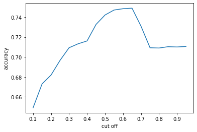
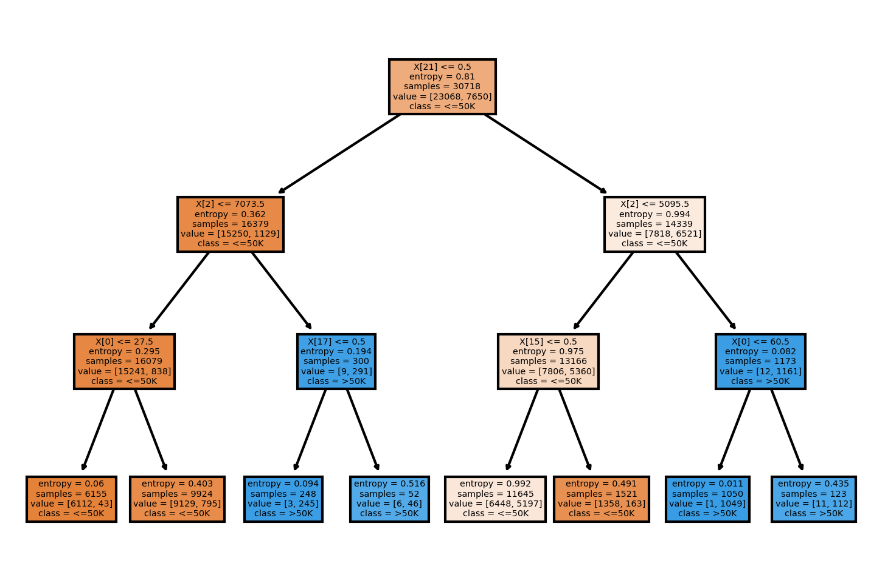
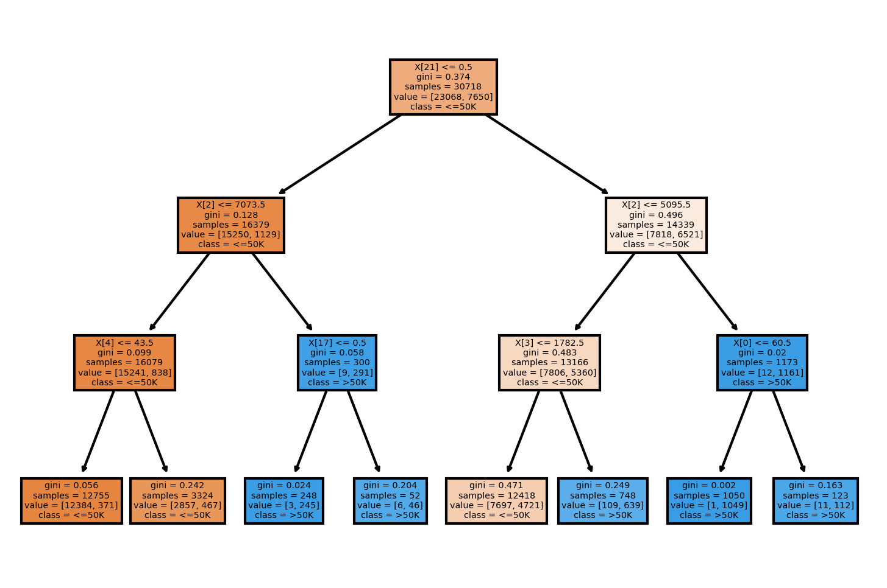
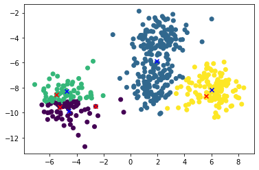
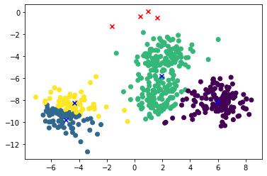

# 1. Naive Bayes

For this problem, first you have create a user-defined fuction for Bernoulli naive Bayes. Then, train a classifier using this function.

For this problem, use the MAGIC Gamma Telescope data set.

The included variabes in this dataset are as follows. 
1. fLength: continuous # major axis of ellipse [mm] 
2. fWidth: continuous # minor axis of ellipse [mm] 
3. fSize: continuous # 10-log of sum of content of all pixels [in #phot] 
4. fConc: continuous # ratio of sum of two highest pixels over fSize [ratio] 
5. fConc1: continuous # ratio of highest pixel over fSize [ratio] 
6. fAsym: continuous # distance from highest pixel to center, projected onto major axis [mm] 
7. fM3Long: continuous # 3rd root of third moment along major axis [mm] 
8. fM3Trans: continuous # 3rd root of third moment along minor axis [mm] 
9. fAlpha: continuous # angle of major axis with vector to origin [deg] 
10. fDist: continuous # distance from origin to center of ellipse [mm] 
11. class: g,h # gamma (signal), hadron (background)


```python
import pandas as pd
import numpy as np
from sklearn.neighbors import KNeighborsClassifier
import matplotlib.pyplot as plt
from sklearn.model_selection import train_test_split

%matplotlib inline

# data load
magic=pd.read_csv('https://drive.google.com/uc?export=download&id=1AoCh22pmLHhdQtYdYUAJJqOCwF9obgVO', sep='\t')

X=magic[magic.columns[:-1]].values
y=magic['class'].values

# data partition
trainX,testX,trainY,testY=train_test_split(X,y,stratify=y,test_size=0.2,random_state=11)
```

(1) Complete the following user-defined function for Bernoulli naive Bayes. 


```python
def BNB(X,y,alpha=1):
    ######## BERNOULLI NAIVE BAYES ########
    # INPUT 
    # X: n by p array (n=# of observations, p=# of input variables)
    # y: output (len(y)=n, categorical variable)
    # alpha: smoothing paramater
    # OUTPUT
    # pmatrix: 2-D array(list) of size c by p with the probability p_ij=P(x_j=1|y_j=i) (i=class, j=feature) 
    #         where c is number of unique classes in y
    # TODO: Bernoulli NB
    
    n,p = X.shape
    binary_matrix = (X >= X.mean(0))*1
                
    pmatrix = []
    class_g = list(y).count("g")
    class_h = list(y).count("h")

    for j in range(p): 
        g = 0
        h = 0
        for k in range(n): 
            if(y[k] == "g" and binary_matrix[k][j] == 1):
                g += 1
            elif(y[k] == "h" and binary_matrix[k][j] == 1):
                h += 1
        p_gj = g / class_g
        p_hj = h / class_h
        pmatrix += [[p_gj,p_hj]]
    
    return pmatrix
```

(2) First, you have to binarize training set (trainX) of MAGIC Gamma Telescope data set. Each column is converted to binary variable based on the average value. If a value is greater than average, set a value as 1. Otherwise, set a value as 0. Then, using new binarized dataset, calculate $p_{ij}$ (i=class,j=feature) with alpha=1. 


```python
BNB(trainX, trainY)
```


    [[0.2839043178593148, 0.4601869158878505],
     [0.26565984188120817, 0.39869158878504674],
     [0.40097303871883233, 0.4732710280373832],
     [0.44790188526251773, 0.46317757009345795],
     [0.43361037907966754, 0.45345794392523364],
     [0.66045003040746, 0.5271028037383177],
     [0.6107845124670586, 0.508411214953271],
     [0.5040543279951348, 0.49700934579439254],
     [0.2350496655179404, 0.6747663551401869],
     [0.4606730184471924, 0.5342056074766355]]


(3) Based on the calculated p_ij, calculate probability of class g for each test sample (testX) and calculate accuracy for testX with varying cutoff (To binarize testX, use the mean of trainX). Prior probabilities of classes are proportional to ratios of classes in training set. cutoff ∈{0.1,0.15,0.2,0.25,…,0.95}. Draw a line plot (x=cutoff, y=accuracy). 


```python
n,p = trainX.shape
cutoff = np.arange(0.10, 1, 0.05)
p_ij = BNB(trainX, trainY) # 클래스가 g일때 x가 1일 확률 p(x=1 | class = g or h)

# binarize testX
binary_testX = (testX >= trainX.mean(0))*1

# prior probabilities of classes in training set - p(class = g)클래스가 g일 확률
prob_g = list(trainY).count("g") / len(trainY) 

# 각 feature별로 1일 확률? -> P(x=1)
prob_1 = [0]*p
for i in binary_testX:
    for j in range(p):
        if i[j] == 1:
            prob_1[j] += 1

for i in range(len(prob_1)):
    prob_1[i] = prob_1[i] / len(binary_testX)


accuracy_scores = []
for c in cutoff:
    result = []
    true_cnt = 0
    
    # 각 테스트 샘플에 대하여 예측 수행
    for i in binary_testX:
        class_g = 1
        # 베르누이 분포
        for j in range(p):
            if i[j] == 1:
                class_g = class_g * p_ij[j][0] / prob_1[j]
            elif i[j] == 0:
                class_g = class_g * (1-p_ij[j][0]) / prob_1[j]
        
        class_g = np.log(class_g * prob_g) # 관찰된 sample이 1일때 클래스가 g일 확률
        if class_g > np.log(c):
            result.append("g")
        else:
            result.append("h")
            
    # 정확도 측정
    for i in range(len(testY)):
        if testY[i] == result[i]:
            true_cnt += 1
    accuracy_score = true_cnt / len(testY)
    
    accuracy_scores.append(accuracy_score)
    
plt.plot(cutoff,accuracy_scores)
plt.xlabel("cut off")
plt.ylabel("accuracy")
plt.xticks(np.arange(0.1,1.0,0.1))
```


    ([<matplotlib.axis.XTick at 0x1949dd0ddc8>,
      <matplotlib.axis.XTick at 0x1949dd0b788>,
      <matplotlib.axis.XTick at 0x1949dd0d488>,
      <matplotlib.axis.XTick at 0x1949e2e01c8>,
      <matplotlib.axis.XTick at 0x1949e2e2288>,
      <matplotlib.axis.XTick at 0x1949e2e9bc8>,
      <matplotlib.axis.XTick at 0x1949e359b08>,
      <matplotlib.axis.XTick at 0x1949e393708>,
      <matplotlib.axis.XTick at 0x1949e396308>],
     [Text(0, 0, ''),
      Text(0, 0, ''),
      Text(0, 0, ''),
      Text(0, 0, ''),
      Text(0, 0, ''),
      Text(0, 0, ''),
      Text(0, 0, ''),
      Text(0, 0, ''),
      Text(0, 0, '')])


    

    


## 2. Decision Tree
The aim of the given data set is to predict annual income of people based on the following factors.
-	age:  the age of an individual
-	capital-gain: capital gains for an individual
-	capital-loss: capital loss for an individual
-	hours-per-week: the hours an individual has reported to work per week
-	sex: 1 if male, 0 if female
-	native-country: 1 if USA, 0 if others
-	workclass_[#]: 1 if an individual belongs to workclass # otherwise 0 (eg. Workclass_Private is 1 if an individual works for private companies)
-	education_[#]: 1 if an individual’s education level is # otherwise 0(education level: Graduate > 4-year university > “<4-year university” > High school > “<High school” > Preschool)
-	marital-status_[#] 1 if an individual’s marital status is # otherwise 0 (Married-civ-spouse corresponds to a civilian spouse while Married-AF-spouse is a spouse in the Armed Forces)
-	occupation_[#]: 1 if an individual’s occupation is # otherwise 0. 
-	race_[#]: 1 if an individual’s race is #, otherwise 0

Target is ‘income’ (“>50K” or “<=50K”)

fnlwgt represents the number of people the census believes the entry represents, which is not used in training. 


```python
import pandas as pd
from sklearn.tree import DecisionTreeClassifier
from sklearn import tree
from sklearn.metrics import accuracy_score
import matplotlib.pyplot as plt

%matplotlib inline
income=pd.read_csv('https://drive.google.com/uc?export=download&id=13HzPLzSDfSwOhvpYOrRSWPMoXzGwYQPx')
```

(1) Train a decision tree with the setting that max_depth=3, min_samples_split=100, min_samples_leaf=50 using entropy. Then, calculate overall accuracy, accuracy of class ">50K", and accuracy of class "<=50K".


```python
income.drop("fnlwgt",axis = 1, inplace = True)
X = income.iloc[:,:-1]
y = income.iloc[:,-1]

t1 = DecisionTreeClassifier(max_depth = 3, min_samples_split = 100, min_samples_leaf = 50, criterion='entropy')
t1.fit(X,y)

# overall
y_pred = t1.predict(X)
print("Overall accuracy: ", accuracy_score(y, y_pred))

# income > 50K
is_upper = income.iloc[:,-1] == ">50K"
income_upper = income[is_upper]
X_upper = income_upper.iloc[:,:-1]
y_upper = income_upper.iloc[:,-1]
y_upper_pred = t1.predict(X_upper)
print(">50K accuracy: ", accuracy_score(y_upper, y_upper_pred))

# income <= 50K
income_lower = income[~is_upper]
X_lower = income_lower.iloc[:,:-1]
y_lower = income_lower.iloc[:,-1]
y_lower_pred = t1.predict(X_lower)
print("<=50K accuracy: ", accuracy_score(y_lower, y_lower_pred))
```

    Overall accuracy:  0.7975454131128329
    >50K accuracy:  0.18980392156862744
    <=50K accuracy:  0.9990896479972255
    

(3) Draw the trained tree


```python
fig = plt.figure(dpi = 300)
tree.plot_tree(t1 ,class_names= y.unique(), filled = True)
```


    [Text(697.5, 792.75, 'X[21] <= 0.5\nentropy = 0.81\nsamples = 30718\nvalue = [23068, 7650]\nclass = <=50K'),
     Text(348.75, 566.25, 'X[2] <= 7073.5\nentropy = 0.362\nsamples = 16379\nvalue = [15250, 1129]\nclass = <=50K'),
     Text(174.375, 339.75, 'X[0] <= 27.5\nentropy = 0.295\nsamples = 16079\nvalue = [15241, 838]\nclass = <=50K'),
     Text(87.1875, 113.25, 'entropy = 0.06\nsamples = 6155\nvalue = [6112, 43]\nclass = <=50K'),
     Text(261.5625, 113.25, 'entropy = 0.403\nsamples = 9924\nvalue = [9129, 795]\nclass = <=50K'),
     Text(523.125, 339.75, 'X[17] <= 0.5\nentropy = 0.194\nsamples = 300\nvalue = [9, 291]\nclass = >50K'),
     Text(435.9375, 113.25, 'entropy = 0.094\nsamples = 248\nvalue = [3, 245]\nclass = >50K'),
     Text(610.3125, 113.25, 'entropy = 0.516\nsamples = 52\nvalue = [6, 46]\nclass = >50K'),
     Text(1046.25, 566.25, 'X[2] <= 5095.5\nentropy = 0.994\nsamples = 14339\nvalue = [7818, 6521]\nclass = <=50K'),
     Text(871.875, 339.75, 'X[15] <= 0.5\nentropy = 0.975\nsamples = 13166\nvalue = [7806, 5360]\nclass = <=50K'),
     Text(784.6875, 113.25, 'entropy = 0.992\nsamples = 11645\nvalue = [6448, 5197]\nclass = <=50K'),
     Text(959.0625, 113.25, 'entropy = 0.491\nsamples = 1521\nvalue = [1358, 163]\nclass = <=50K'),
     Text(1220.625, 339.75, 'X[0] <= 60.5\nentropy = 0.082\nsamples = 1173\nvalue = [12, 1161]\nclass = >50K'),
     Text(1133.4375, 113.25, 'entropy = 0.011\nsamples = 1050\nvalue = [1, 1049]\nclass = >50K'),
     Text(1307.8125, 113.25, 'entropy = 0.435\nsamples = 123\nvalue = [11, 112]\nclass = >50K')]


    

    


(6) Train a new tree by changing a metric for finding split rules from entropy to gini impurity and compare two models in terms of the performance of the models and the generated rules


```python
t2=DecisionTreeClassifier(max_depth=3,min_samples_split=100,min_samples_leaf=50,criterion='gini')
t2.fit(X,y)

#overall
y_pred_gini = t2.predict(X)
print("Overall accuracy: ", accuracy_score(y, y_pred_gini))

# income > 50K
y_upper_pred_gini = t2.predict(X_upper)
print(">50K accuracy: ", accuracy_score(y_upper, y_upper_pred_gini))

# income <= 50K
y_lower_pred_gini = t2.predict(X_lower)
print("<=50K accuracy: ", accuracy_score(y_lower, y_lower_pred_gini))

# draw tree plot
fig=plt.figure(dpi=300)
tree.plot_tree(t2,class_names=y.unique(), filled=True)
```

    Overall accuracy:  0.8147991405690475
    >50K accuracy:  0.2733333333333333
    <=50K accuracy:  0.9943644876018727
    


    [Text(697.5, 792.75, 'X[21] <= 0.5\ngini = 0.374\nsamples = 30718\nvalue = [23068, 7650]\nclass = <=50K'),
     Text(348.75, 566.25, 'X[2] <= 7073.5\ngini = 0.128\nsamples = 16379\nvalue = [15250, 1129]\nclass = <=50K'),
     Text(174.375, 339.75, 'X[4] <= 43.5\ngini = 0.099\nsamples = 16079\nvalue = [15241, 838]\nclass = <=50K'),
     Text(87.1875, 113.25, 'gini = 0.056\nsamples = 12755\nvalue = [12384, 371]\nclass = <=50K'),
     Text(261.5625, 113.25, 'gini = 0.242\nsamples = 3324\nvalue = [2857, 467]\nclass = <=50K'),
     Text(523.125, 339.75, 'X[17] <= 0.5\ngini = 0.058\nsamples = 300\nvalue = [9, 291]\nclass = >50K'),
     Text(435.9375, 113.25, 'gini = 0.024\nsamples = 248\nvalue = [3, 245]\nclass = >50K'),
     Text(610.3125, 113.25, 'gini = 0.204\nsamples = 52\nvalue = [6, 46]\nclass = >50K'),
     Text(1046.25, 566.25, 'X[2] <= 5095.5\ngini = 0.496\nsamples = 14339\nvalue = [7818, 6521]\nclass = <=50K'),
     Text(871.875, 339.75, 'X[3] <= 1782.5\ngini = 0.483\nsamples = 13166\nvalue = [7806, 5360]\nclass = <=50K'),
     Text(784.6875, 113.25, 'gini = 0.471\nsamples = 12418\nvalue = [7697, 4721]\nclass = <=50K'),
     Text(959.0625, 113.25, 'gini = 0.249\nsamples = 748\nvalue = [109, 639]\nclass = >50K'),
     Text(1220.625, 339.75, 'X[0] <= 60.5\ngini = 0.02\nsamples = 1173\nvalue = [12, 1161]\nclass = >50K'),
     Text(1133.4375, 113.25, 'gini = 0.002\nsamples = 1050\nvalue = [1, 1049]\nclass = >50K'),
     Text(1307.8125, 113.25, 'gini = 0.163\nsamples = 123\nvalue = [11, 112]\nclass = >50K')]


    

    


## 3 $k$-means clustering
This problem uses the data generated from 4 normal distributions for applying $k$-means clustering. 
k-means implemented in sci-kit learn can assign initial centeroids through ‘init’. When init is set as $c$ by $p$ array ($c$ = the number of clusters, $p$ = the number of features), each row is used as a centroid.


```python
from sklearn.cluster import KMeans
from sklearn import datasets
from sklearn.metrics import silhouette_score, adjusted_rand_score
import matplotlib.pyplot as plt
from numpy import random

X,y=datasets.make_blobs(n_samples=500, n_features=2, cluster_std=1, random_state=68, centers=4)
```

(1) Select randomly 4 samples from the given data set and use them as initial centroids. This procedure is repeated for 100 times. Then, calculate the average values of the silhouette coefficient and adjusted rand index values for 100 iteration. 


```python
silhoutte_coefficient_dataset = []
ARI_dataset = []
min_centroid_X_dataset = np.zeros((4,2))
min_final_centroid_X_dataset = np.zeros((4,2))
min_silhoutte_coefficient_dataset = 0

for i in range(100):
    centroid_X = np.zeros((4,2))
    # 랜덤으로 4개 선택
    rand = random.randint(500, size = 4)
    for j in range(len(rand)):
        centroid_X[j] = np.array(X[rand[j]])
    kmeans = KMeans(n_clusters=4, init=centroid_X ,n_init=1)
    kmeans.fit(X)
    kmeans_label = kmeans.labels_
    
    silhoutte = silhouette_score(X, kmeans_label)
    ARI = adjusted_rand_score(y, kmeans_label)
    
    silhoutte_coefficient_dataset.append(silhoutte)
    ARI_dataset.append(ARI)
    
    final_centroid_X = kmeans.cluster_centers_
    
    if i == 0:
        min_centroid_X_dataset = centroid_X
        min_silhoutte_coefficient_dataset = silhoutte
        min_final_centroid_X_dataset = final_centroid_X
        min_kmeans_label_dataset = kmeans_label
    else :
        if min_silhoutte_coefficient_dataset > silhoutte:
            min_centroid_X_dataset = centroid_X
            min_silhoutte_coefficient_dataset = silhoutte
            min_final_centroid_X_dataset = final_centroid_X
            min_kmeans_label_dataset = kmeans_label
            
avg_silhoutte = np.mean(silhoutte_coefficient_dataset)
avg_ARI = np.mean(ARI_dataset)

print("average values of the silhouette coefficient : " , avg_silhoutte)
print("average values of the adjusted rand index values : " , avg_ARI)
```

    average values of the silhouette coefficient :  0.573261826136007
    average values of the adjusted rand index values :  0.8933017258791313
    

(2) Select randomly one sample from each normal distribution and use them as initial centroids. This procedure is repeated for 100 times. Then, calculate the average values of the silhouette coefficient and adjusted rand index values for 100 iteration. 


```python
silhoutte_coefficient_normal = []
ARI_normal = []
min_centroid_X_normal = np.zeros((4,2))
min_final_centroid_X_normal = np.zeros((4,2))
min_silhoutte_coefficient_normal = 0

for i in range(100):
    centroid_X = random.normal(0,1,(4,2))
    kmeans = KMeans(n_clusters=4, init=centroid_X ,n_init=1)
    kmeans.fit(X)
    kmeans_label = kmeans.labels_
    
    silhoutte = silhouette_score(X, kmeans_label)
    ARI = adjusted_rand_score(y, kmeans_label)
    
    silhoutte_coefficient_normal.append(silhoutte)
    ARI_normal.append(ARI)
    
    final_centroid_X = kmeans.cluster_centers_
    
    if i == 0:
        min_centroid_X_normal = centroid_X
        min_silhoutte_coefficient_normal = silhoutte
        min_final_centroid_X_normal = final_centroid_X
        min_kmeans_label_normal = kmeans_label
    else :
        if min_silhoutte_coefficient_normal > silhoutte:
            min_centroid_X_normal = centroid_X
            min_silhoutte_coefficient_normal = silhoutte
            min_final_centroid_X_normal = final_centroid_X
            min_kmeans_label_normal = kmeans_label
            
avg_silhoutte = np.mean(silhoutte_coefficient_normal)
avg_ARI = np.mean(ARI_normal)

print("average values of the silhouette coefficient : " , avg_silhoutte)
print("average values of the adjusted rand index values : " , avg_ARI)
```

    average values of the silhouette coefficient :  0.5040823522411079
    average values of the adjusted rand index values :  0.719489798676619
    

(3) Draw a scatter plot for the given data with initial centroids and final centroids for the worst case among 100 trials in Question 3-(1). The initial centroids should be marked as red ‘X’ and the final centroids should be marked as blue ‘X’. 


```python
plt.scatter(X[:,0],X[:,1], c = min_kmeans_label_dataset)
plt.scatter(min_centroid_X_dataset[:,0], min_centroid_X_dataset[:,1], marker = 'x', c = 'r')
plt.scatter(min_final_centroid_X_dataset[:,0], min_final_centroid_X_dataset[:,1], marker = 'x', c = 'b')
```


    <matplotlib.collections.PathCollection at 0x22539e9e888>


    

    


(4) Draw a scatter plot for the worst case of Question 3-(2) in the same way as in Question 3-(3).  


```python
plt.scatter(X[:,0],X[:,1], c = min_kmeans_label_normal)
plt.scatter(min_centroid_X_normal[:,0], min_centroid_X_normal[:,1], marker = 'x', c = 'r')
plt.scatter(min_final_centroid_X_normal[:,0], min_final_centroid_X_normal[:,1], marker = 'x', c = 'b')
```


    <matplotlib.collections.PathCollection at 0x22539f14a48>


    

    

