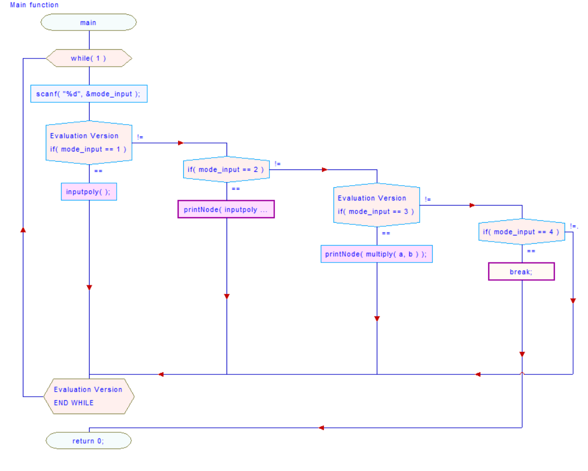

17102063 Lee you seok

**Programming Assignment #0**

Student : 17102063 Lee you seok

Operating System Design 146043 and 31001

Instructor : Lee youn ho

**Due : 3/16/2021**

**Problem:**

1. Represent a polynomial with a form of a doubly linked list using the structure that have {int degree, int coefficient, struct Node \*next, struct Node \*prev}
1. Using the ‘Node’ structure, implement followings
   1. Node \*inputpoly(void) : It takes at least a pair of (degree, coefficient) data by user and outputs polynomial represented as a doubly linked list with the above Node structure.
   1. Void printNode(Node \*inp) : It takes the head node of the doubly linked list and print out the representing polynomials.
   1. Node \*multiply(Node \*a, Node \*b): This function multiplies the two polynomials ‘a’ and ‘b’ and returns the multiplication result.

**Structure Chart:** 

**Implementation:**

- structure NODE \*Inputpoly( );
  - Subprogram
    - Init();
      - This function makes a head and tail node for doubly linked list.
    - Input(int coefficient, int degree);
      - This function makes a new node and input the node into correct place of input node.
  - Output
    - Return the head that points the next node 
  - Algorithm
    - Input function
      - Infinite Loop
        - If the pointer points to the tail
          - One space forward
        - ` `Else
          - Move one space forward until degree of pointer is less than degree of new node
            - Insert input node between what the pointer points and what is behind it
- void printnode(structure Node \*head);
  - Input
    - the head of node from inputpoly( ) function return
  - Algorithm
    - Sum nodes that have same degree
      - Loop until pointer points tail
        - Loop until the current degree and the next degree are different
          - Sum the nodes that have same degree
        - Move the pointer to get next node
    - Print
      - Loop until pointer moves to before step 2 of the tail
        - Print(coefficient x^ degree + );
        - Move the pointer to get next node
      - Print(coefficient x^ degree);
- structure NODE \*multiply(structure NODE \*a, structure NODE \*b);
  - Input
    - the two head of nodes from inputpoly() function return
  - Output
    - the head of node of result from multiply inputs
  - Algorithm
    - Loop until pointer1 points the tail of 1st input node
      - Move the pointer2 to the starting point of 2nd input node
      - Loop until pointer2 points the tail of 2nd input node
        - Coefficient = Coefficient of pointer1 \* Coefficient of pointer2
        - Degree = degree of pointer1 + degree of pointer2
        - Input(coefficient, degree);
        - Move the pointer2 to get the next
      - Move the pointer1 to get the next

Input (degree) (coefficient): 2 2

Input (degree) (coefficient): 1 1

Input (degree) (coefficient): 0 1

Input (degree) (coefficient): -1 1

Input (degree) (coefficient): 1 0

Input (degree) (coefficient): -1 -1

Done!!

1 + 1x + 2 x^2

Test Description and Result

- That is printpoly(inputpoly()); test. Through this test case, you can see that the sort ascending ordering by degree of the polynomials and the case where the degree and coefficient of the polynomial are each 0 are handled. Also, as indicated in the assignment instructions, when only one of the input degree and coefficient is negative, it is ignored, and when both are negative, the program is terminated.

Input (degree) (coefficient): 2 2

Input (degree) (coefficient): 1 1

Input (degree) (coefficient): 0 1

Input (degree) (coefficient): -1 -1

Done!!

Input (degree) (coefficient): 2 2

Input (degree) (coefficient): 1 1

Input (degree) (coefficient): 0 1

Input (degree) (coefficient): -1 -1

Done!!

1 + 2x + 5x^2 + 4x^3 + 4x^4

- That is test for multiply()function. Through this test case, you can see that the multiplication of the two basic polynomials and the multiplication process when the term of the polynomial is a constant term are performed.
