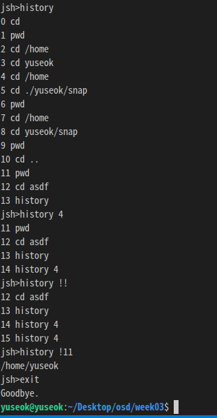

17102063 Lee you seok

**Programming Assignment #1**

Student : 17102063 Lee you seok

Operating System Design 146043 and 31001

Instructor : Lee youn ho

**Due : 3/30/2021**

**Problem:**

1. Complete the project described in page 149 to 152.
1. With SimpleShell program in Figure 3.37, implement followings
   1. By splitting user input into a String array based on a single space, save the result in a string array. 
   1. Create a Scanner or BufferedReader to read the output string of the process builder object. OSProcess will print out the result of the command.
   1. Implement the “exit” or “quit” for exiting system. Also, implement “cd” comment and “history” comment. 

**What did you learn?**

1. How far did you get in this project? What grade are you expecting? Did you find the milestones in the description helpful? Do you think you could have gotten the project working as well as you did without the milestones? 
   1. I finished everything on this project. As shown in the description, the use of the File object in the CD part and the use of the ArrayList in the history part were able to get the direction.
1. Do you feel like a better programmer now that you’ve completed this project? How does this compare to programming project that you’ve had in prior class?
   1. Yes I feel like a better programmer to deal with OSProcess in linux. 
1. Describe Problem (relating to this assignment) that arose while you were working on this project and explain how you solved them. 
   1. About History !! and History !<number>, I wanted to separate the loop to start from the part after the user input in the existing while loop in order to restart the corresponding record. To solve this problem, an alias was assigned to the loop, and an alias was added to the continue statement, so that the loop starts again from where I want.

1. How long did you spend on this assignment? Give me specifics.

|**Date**|**Time**|**Activities**|**Outcomes**|
| :- | :- | :- | :- |
|2021-03-21|08:30 ~ 09:00|Read project description||
||09:00 ~ 09:40|Type OSProcess in Figure 3.13 and understand it||
||09:40 ~ 10:00|Type the SimpleShell in Figure 3.37||
||10:20 ~ 10:50|Use split() method and use Array List |Split user input based on single space and add String that is result of split() object into my Array List|
||11:00 ~ 12:00|Create ProcessBuilder and BufferedReader |Read the output string of the processbuilder to run OSProcess|
||14:00 ~ 14:30|Add code for exit system|If command entered is “exit” or “quit”, exits the program|
||14:30 ~ 15:10|Add cd command to change directories|If user input after cd is existing directory indicating the full path, the file path move to the input directory |
||15:10 ~ 16:30|Add relative path function to cd command|If user input is “cd ..” or “cd directory”, the file path move to parent folder or specific folder entered.|
||16:30 ~ 18:30|Add a History feature|Print the history in history, or run a specific history again.|
||20:30 ~ 22:30|||
|2021-03-22|13:00 ~ 16:00|Check the testing case and modify some part|It works as “cd” and “history <number>” command.|
||16:00 ~ 17:15|Write the readme and documentation for question and testcase.||
|2021-03-23|19:00 ~ 19:30|According to the updated instructions, the code, read me, and report have been revised.||
1. Total hours spent.  Try to be honest and do not exaggerate here. 
   1. The total hours : About 16hours 

**Test description and Result**

1. The shell program can compile and run successfully and ProcessBuilder object is correctly created, ps, ls, and cat command works. And, also “quit” command works well.

1. When type “cd” and “pwd”, you can check the directory was changed to /home/user. Also, it shows handling absolute path, relative path, and error .

3. Test case #3 will be in next page.

1.  Following test case #2, When type “history” or “history <number>”, the shell print out of history of commands. And, when type “history !!” or “history !<number>”, the shell run the corresponding command in the history. 

