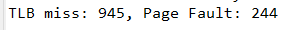
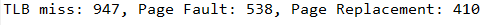
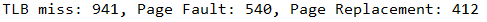

17102063 Lee you seok

**Implementation assignment #4**

Student : 17102063 Lee you seok

Operating System Design 146043 and 31001

Instructor : Lee youn ho

**Due : 6/01/2021**

**Problem:**

**1. Analyze the source codes in the project to understand how the required functions are implemented.**

Virtual Memory Manager is Java Program that translates logical addresses to physical addresses for a Virtual address space of size 216 = 65,536bytes. The program will read from ‘InputFile.txt’ containing logical addresses and, first check the TLB as well as Page Table and then, check the ‘BACKING\_STORE’. After that, program will translate each logical address to its corresponding physical address and output is Virtual and Physical address also, the value of the byte stored at the translated physical address. The left figure is the whole structure of AddressTranslator.java that is the main java class file. And there are several classes that support the AddressTranslator.java. BackStore.java / PageTable.java / PhysicalMemory.java / TLB.java. 

**AddressTranslator.java**

AddressTranslator.java contains that the main class in which the program is executed.  In the main class, there are several variables that are int addr (logical address), int p\_num (page number), int offset(offset), int f\_num(frame number), int value(value stored in address), int phy\_addr(physical addresss), int tlb\_miss(0, count of TLB miss), int page\_fault(count of page fault). When the program starts, the scanner reads the file containing the logical address. After that, each class is instantiated to create each object. It repeats the logical addresses of the input file and converts them to physical addresses. Each logical address is divided by 256, and the remainder is stored as an offset, and the quotient is stored as a page number. Check if the page number is in the TLB. If it is in the TLB, TLB hit has occurred and, the frame number is received and stored into ‘f\_num’. If it is not in the TLB, a TLB miss has occurred, and pt.get(int p\_num) checks if the page number is in the page table. If the requested page number is in the page table, the frame number is received and stored. If it is not in the page table, a page fault has occurred. If so, it receives the frame that matches the requested page number from the backing storage and stores it in the frame object f. Load Frame f into physical memory and store the frame number in ‘f\_num’. Both the page number and frame number are stored in the page table and TLB. Physical address is created with frame number \* 256 + offset. The value is obtained from the transmitted frame number, off-set and from the frame stored in physical memory. 

**TLB.java**

TLB.java has HashTable and LinkedList structures. Hashtable is initialized to store 16 page numbers and frame numbers. The get(int p\_num) method in the TLB class checks whether the requested page number is in the TLB, and if so, returns the frame number. If not, it returns -1. The Put(int p\_num, int f\_num) method deletes the oldest data in the TLB and stores the newly entered page number and frame number.

**PageTable.java**

In PageTable.java, there are 2 classes. First, PageTableItem.class initialize the int type frameNumber and Boolean type valid to store for check it is valid frame or not in the constructor. And, the getFrameNumber() method return the frame number. Second, PafeTable.class initialize the PageTableItem that size is 256 with the frame number is -1 and valid state is invalid(false). The get(int p\_num) method return frame number from PageTableItem using the passed page number. If there is no page number in the table, return -1. And, add(int p\_num, int f\_num) will add page number , frame number to pageTable.

**PhysicalMemory.java**

In PageTable.java, there are 2 classes. First, Frame.class initialize the int array type data that store data of frame. In PageTable.java, there are 2 classes. First, Frame.class initialize the int array type data that store data of frame. There are two ways to create a Frame constuctor. Basically, there is a method of receiving an int array of 256 size and inputting it to the data list of current frame. Another method is to receive the Frame object f and copy the values ​​of Frame f to the data list of the current frame. PhysicalMemory.class, the second class using this frame object, initializes a variable called int currentFreeFrame, which is a pointer which free frame and the frames array that contains using frame in memory. The addFrame(Frame f) method adds the received Frame f to the currentFreeFrame position in the frames array. After that, the pointer currentFreeFrame is increased by 1 and the position where the current Frame f is added to memory is returned. And getValue(int f\_num, int offset) method return value that is corresponding with the received frame number and offset.

**BackStore.java**

In BackStore.java, the static method getData(int pageNum) Initializes value, which is a byte array, and result, which is an int array. Both lists' size is 256. In the “BACKING\_STORE” file where the values ​​corresponding to each page number are stored, read values ​​from the page number \*256 position to 256 byte size, and store the corresponding values ​​in a byte array value. After that, it stores the values ​​of array value in result, which is an int array, and returns the result.

**Result Analysis**

Original 

FIFO 

LRU  

As you can see, the number of TLB misses in the 3 method is similar. However, there is a lot of difference in the number of page faults between original in which physical memory accommodates 256 frames and (FIFO&LRU) in which physical memory accommodates 128 frames. In addition, there was not much difference in the number of page replacements between the two methods that are FIFO and LRU. 
